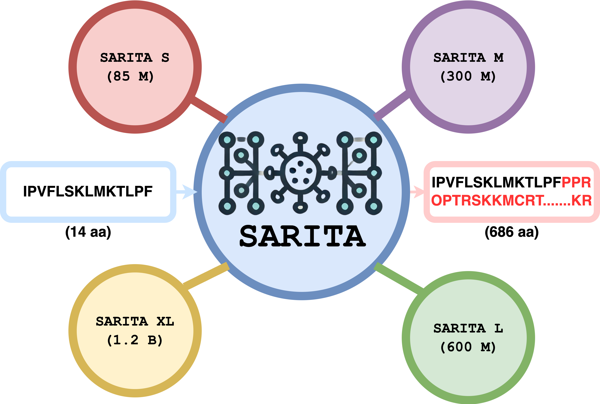
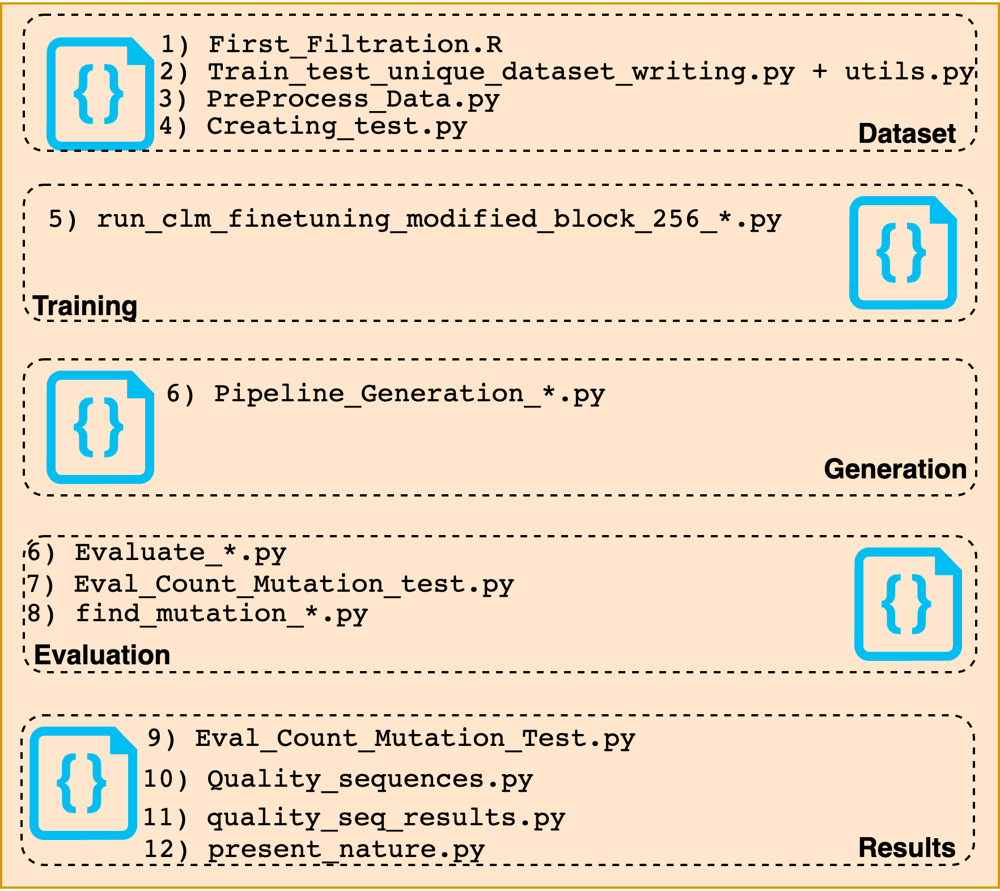
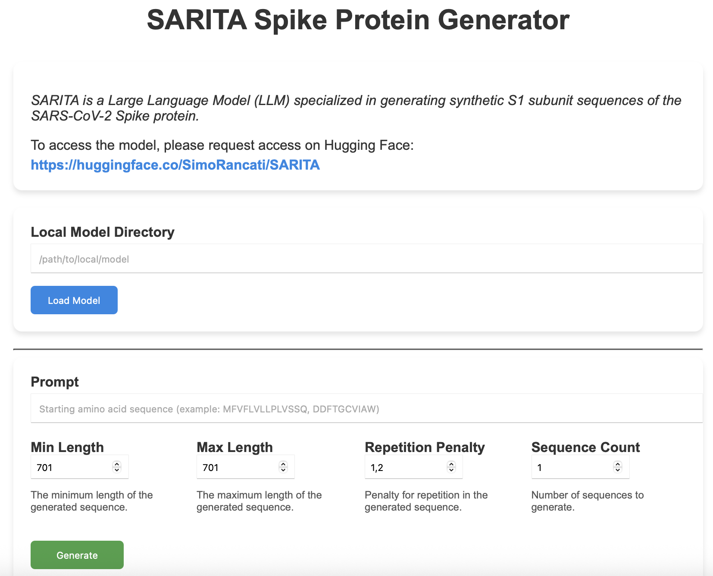

# SARITA

SARITA, a GPT-3-based LLM with up to 1.2B parameters, generates synthetic SARS-CoV-2 Spike S1 sequences. Built on the RITA protein model, it uses continuous learning. When trained on Alpha, Beta, and Gamma variants (data up to Feb 2021), SARITA accurately predicts future S1 mutations. The Pre-print paper is avaiable [here](https://www.biorxiv.org/content/10.1101/2024.12.10.627777v1)

This model is a continuous learning of [lightonai/RITA](https://huggingface.co/lightonai).

SARITA models trained with high-quality SARS-CoV-2 S1 sequences from December 2019 - March 2021. **Click on any model name (e.g. Small, Medium, Large and XLarge) to go to its dedicated page, where you’ll find detailed access instructions and example code snippets to help you reproduce our results.**

Model | #Params | d_model | layers 
--- | --- | --- | --- | 
[Small](https://huggingface.co/SimoRancati/SARITA_S) | 85M  | 768 | 12 
[Medium](https://huggingface.co/SimoRancati/SARITA_M) | 300M | 1024 | 24 
[Large](https://huggingface.co/SimoRancati/SARITA_L)| 680M | 1536 | 24 
[XLarge](https://huggingface.co/SimoRancati/SARITA_XL)| 1.2B | 2048 | 24 


SARITA models trained with high-quality SARS-CoV-2 S1 sequences from December 2019 - August 2024. **Click on any model name (e.g. Small, Medium, Large and XLarge) to go to its dedicated page, where you’ll find detailed access instructions and example code snippets to help you reproduce our results.**

Model | #Params | d_model | layers 
--- | --- | --- | --- | 
[Small](https://huggingface.co/SimoRancati/SARITA_S.0.1) | 85M  | 768 | 12 
[Medium](https://huggingface.co/SimoRancati/SARITA_M.0.1) | 300M | 1024 | 24 
[Large](https://huggingface.co/SimoRancati/SARITA_L.0.1)| 680M | 1536 | 24 
[XLarge](https://huggingface.co/SimoRancati/SARITA_XL.0.1)| 1.2B | 2048 | 24 


## Model description

SARITA is an LLM with up to 1.2B parameters, based on GPT-3 architecture, designed to generate high-quality synthetic SARS-CoV-2 Spike sequences. 
SARITA is trained via continuous learning on the pre-existing protein model RITA.

## Intended uses & limitations

This model can be used by user to generate synthetic Spike proteins of SARS-CoV-2 Virus. 

### Framework versions

- Transformers 4.20.1
- Pytorch 1.9.0+cu111
- Datasets 2.18.0
- Tokenizers 0.12.1


### Usage 
Instantiate a model like so:
``` python
from transformers import AutoModelForCausalLM, AutoTokenizer
# Download manually from the HuggingFace Repository the model in your local environment
model = AutoModelForCausalLM.from_pretrained("Path/SARITA_*", trust_remote_code=True)
tokenizer = AutoTokenizer.from_pretrained("Path/SARITA_*")
```
If you want to generate the S1 subunit sequence or longer sequence, use this code:
``` python
# Check for GPU availability and move the model to GPU
device = "cuda" if torch.cuda.is_available() else "cpu"
model = model.to(device)

start = ['MFVFLVLLPLVSSQ']

for i in range(len(start)):
    # Prepare model inputs
    model_inputs = tokenizer([start[i]], return_tensors="pt")
    model_inputs = {k: v.to(device) for k, v in model_inputs.items()}

    # Generate predictions using the model
    generated_ids = model.generate(**model_inputs, min_length=701, max_length=701,
                                   do_sample=True, top_k=950, repetition_penalty=1.2,
                                   num_return_sequences=100, eos_token_id=2, truncation=True)

    # Decode and print outputs
    generated_sequences = []
    for f in range(len(generated_ids)):
        sequence = tokenizer.decode(generated_ids[f], skip_special_tokens=True).replace(' ', '')
        generated_sequences.append(sequence)
```
If you want to generate the S1 subunit sequence, use this code:
``` python
# Check for GPU availability and move the model to GPU
device = "cuda" if torch.cuda.is_available() else "cpu"
model = model.to(device)

start = ['MFVFLVLLPLVSSQ']

for i in range(len(start)):
    # Prepare model inputs
    model_inputs = tokenizer([start[i]], return_tensors="pt")
    model_inputs = {k: v.to(device) for k, v in model_inputs.items()}

    # Generate predictions using the model
    generated_ids = model.generate(**model_inputs, min_length=687, max_length=687,
                                   do_sample=True, top_k=950, repetition_penalty=1.2,
                                   num_return_sequences=100, eos_token_id=2, truncation=True)

    # Decode and print outputs
    generated_sequences = []
    for f in range(len(generated_ids)):
        sequence = tokenizer.decode(generated_ids[f], skip_special_tokens=True).replace(' ', '')
        generated_sequences.append(sequence)
```
If you want to generate other subunit sequence (Example RBD), use this code:
``` python
# Check for GPU availability and move the model to GPU
device = "cuda" if torch.cuda.is_available() else "cpu"
model = model.to(device)

start = ['DDFTGCVIAW']

for i in range(len(start)):
    # Prepare model inputs
    model_inputs = tokenizer([start[i]], return_tensors="pt")
    model_inputs = {k: v.to(device) for k, v in model_inputs.items()}

    # Generate predictions using the model
    generated_ids = model.generate(**model_inputs, min_length=79, max_length=79,
                                   do_sample=True, top_k=950, repetition_penalty=1.2,
                                   num_return_sequences=100, eos_token_id=2, truncation=True)

    # Decode and print outputs
    generated_sequences = []
    for f in range(len(generated_ids)):
        sequence = tokenizer.decode(generated_ids[f], skip_special_tokens=True).replace(' ', '')
        generated_sequences.append(sequence)
```
# Repository

This Repository contains all the code used to built the [datatset](/Dataset), to [train the model](/Training), to [generate synthetic sequences](/Generation) and to [evaluate the different models](/Evaluation)

# Dashboard


## 💻 Installation

To run the dashboard locally, you need Python ≥ 3.8 and the following packages:

```bash
pip install torch==2.7.0
pip install dash==2.8.1
pip install plotly==5.13.1
```
## 🚀 How to Launch

1. Clone this repository
```bash
git clone https://github.com/your-username/SARITA-dashboard.git
cd SARITA-dashboard
```
2. Download the model checkpoint
    After approval on Hugging Face, download the SARITA model files and place them in a local directory.
3. Run the dashboard
```bash
python dashboard.py
```
4. Open the app in your browser
5. Go to http://127.0.0.1:8050. The dashboard should open automatically.

## 🧪 How to Use

Once the dashboard is loaded, follow these steps:

1. Load the Model from  in the “Local Model Directory” field, enter the path to the folder containing the model files. Click Load Model to initialize.
3. Configure Sequence Generation

    a) Prompt: Optional amino-acid starting sequence (e.g., MFVFLVLLPLVSSQ);
   
    b) Min/Max Length: Define the desired length of the generated sequence;
   
    c) Repetition Penalty: Set a value (e.g., 1.2) to discourage repeated residues;
   
    d) Sequence Count: Number of sequences to generate.
4. Click Generate
    The model will produce the sequence(s), save them locally as .fasta files, and display a bar plot of the amino acid distribution.
## 📂 Output
Sequences are saved in the current working directory in FASTA format. Each result is accompanied by a residue composition chart, to help assess the diversity and structure of the generated sequence.

# IMPORTANT 
SARITA model is public, but downloading it requires approval.  
To request access, go to [HuggingFace](https://huggingface.co/SimoRancati/SARITA) and click on the relative that you want and click on the **Request Access** button and provide a brief explanation of your intended use.

## License
The use of this model is restricted to research purposes. Commercial use is not allowed without prior approval.
